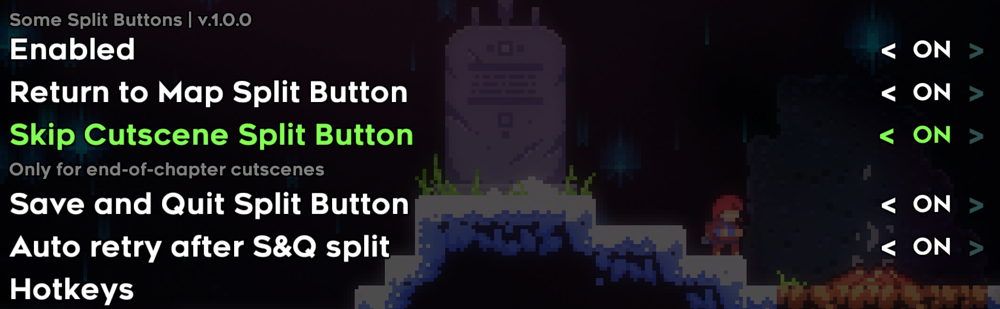
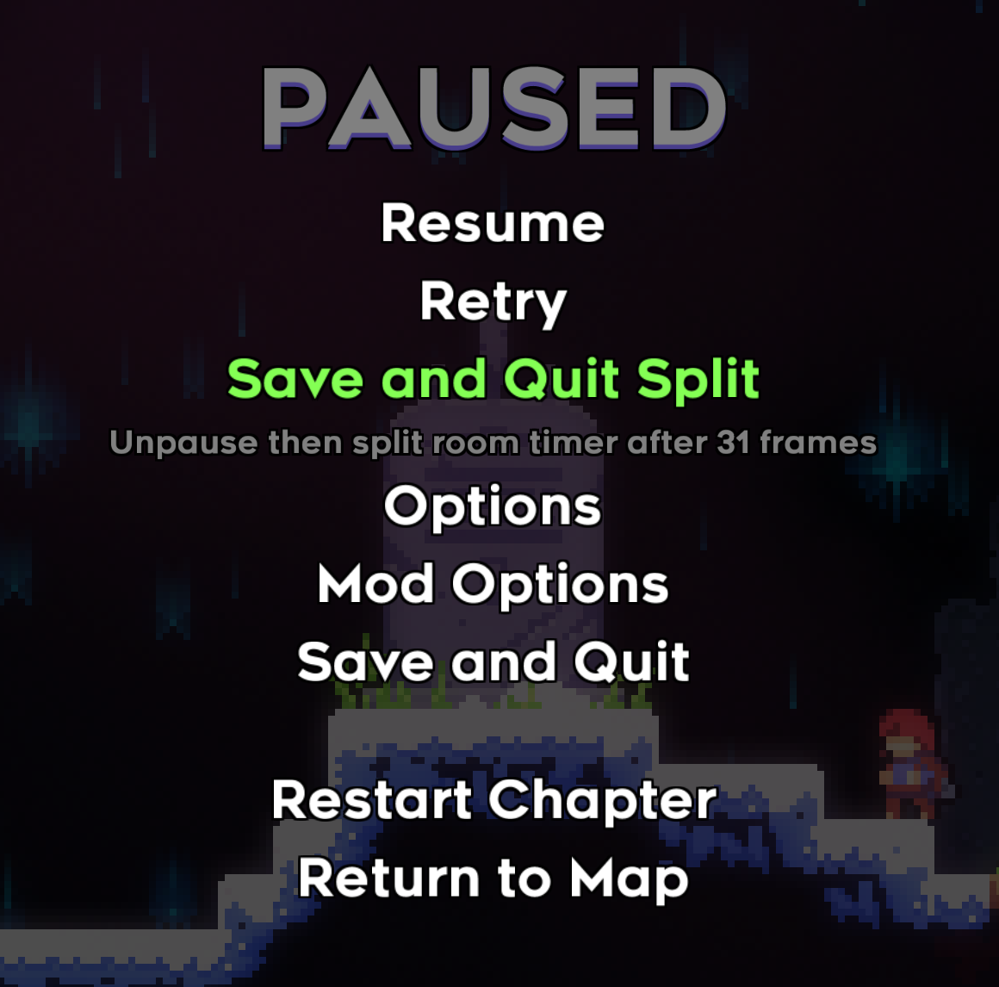

# Some Split Buttons

Pause-menu buttons that split [SpeedrunTool](https://gamebanana.com/mods/53687)'s room timer at the
moment a real Save and Quit, Return to Map or cutscene skip would — so a segment that ends in one
can be practised and compared like any other.

Inspired by [WonderMods](https://github.com/WonderGinger/WonderMods)' Return to Menu split button.



## Requirements

- **Everest** 1.5935.0 or newer.
- **SpeedrunTool** 3.26.4 or newer. It is a hard dependency, not an optional one: "room timer"
  throughout this README means SpeedrunTool's room timer, and every split this mod makes is a call
  into it.

## Getting started

**All three buttons are off by default.** Installing the mod and pausing shows nothing until you
turn one on, in **Mod Options → Some Split Buttons**. Each button can also be toggled from gameplay
with a hotkey — see below.

## The buttons

Each one unpauses, waits the number of frames the real action would have taken, and then splits.
The wait is what makes the split land where it would in a run rather than where you pressed.

| Button | Where it is | Wait |
|---|---|---|
| Skip Cutscene Split | second entry, one Down press | 18 frames (232 in the Prologue) |
| Save and Quit Split | third entry, two Down presses | 31 frames |
| Return to Map Split | last entry | 31 frames |

- **Skip Cutscene Split** only appears during an end-of-chapter cutscene, and disappears after one
  use until the level is reloaded.
- **Save and Quit Split** re-enters the room afterwards by default, exactly as the game does when a
  chapter is resumed after a real Save and Quit. Turn *Re-enter the Room After the Split* off to
  split without reloading; the chapter clock is then held stopped until you have control again,
  which is what a real Save and Quit would have done to it.
- **Return to Map Split** asks for confirmation first, the way vanilla Return to Map does.



## Hotkeys

**Mod Options → Some Split Buttons → Hotkeys** binds a key or a controller button to each split
button's on/off toggle, so you can arm one mid-run without opening the menu. A toggle announces
itself on screen, since nothing else would show it.

- Binding several keys to one slot makes a combo: all of them must be held.
- Binding a key that is already in the slot **removes** it.
- A binding that is contained in a longer one does not fire when the longer one does — bind
  `F` and `Ctrl+F` to two different buttons and Ctrl+F toggles only the second.
- The overlay times out after five seconds and says so while it counts down. Escape cancels it.

⚠️ **Toggling a button by hotkey while the pause menu is open does not change the menu you are
looking at.** The pause menu is built when you pause; the button appears or disappears the next
time you pause.

## Collect protections

Leaving a chapter while a collectible is still being written to the save loses it, so the Save and
Quit and Return to Map splits refuse to fire and say how many frames are still needed.

- **Crystal hearts are always protected**, and this cannot be switched off. A split before the heart
  is banked is not a faster version of the strat — it is one the game does not allow.
- **Red berries are protected by default**, and *Berry Collect Protection* turns that off for
  practice where the berry is not the point. **Vanilla red berries only**: golden berries are
  ignored on purpose, and modded collectibles that are not `Strawberry` — CollabUtils silver and
  speed berries, for instance — are not seen at all.

⚠️ **A refused split still unpauses.** That is deliberate: what the refusal counts down — a berry or
a heart still collecting — only advances while the game is running, so staying paused would freeze
the very wait the message asks you to wait out. Pause again and press once the frames have passed.

⚠️ **While the Skip Cutscene button is enabled, SpeedrunTool's room timer keeps running through
every chapter ending**, including ones you finish by watching the cutscene or by using vanilla Skip
Cutscene. That is what lets the button split at the mark instead of at the cutscene trigger. Turn
the button off if you want SpeedrunTool's own end-of-chapter behaviour back.

## For mod authors: the split observer API

The mod exports a ModInterop surface under the name `SomeSplitButtons`, so another mod can watch
the split buttons without referencing this assembly.

```csharp
[ModImportName("SomeSplitButtons")]
public static class SomeSplitButtons {
    public static Action<Action<string, string, ulong>> AddSplitObserver;
    public static Action<Action<string, string, ulong>> RemoveSplitObserver;
    public static Func<int> InteropVersion;
}

// in Load(), after typeof(SomeSplitButtons).ModInterop():
SomeSplitButtons.AddSplitObserver?.Invoke((action, stage, frame) =>
    Logger.Log("MyMod", $"{action} {stage} on frame {frame}"));
```

`observer(action, stage, frame)` is called with `frame` being `Engine.FrameCounter`.

- **Actions:** `SkipCutscene`, `SaveAndQuit`, `ReturnToMap`.
- **Stages:** `Pressed`, `Opened`, `Confirmed`, `Cancelled`, `Refused`.
- **Sequences.** Every `Pressed` is followed by exactly one terminal stage — `Confirmed`,
  `Cancelled` or `Refused` — on every path. `Opened` terminates nothing.
  - Skip Cutscene: `Pressed` → `Confirmed`.
  - Save and Quit: `Pressed` → `Confirmed` | `Refused`.
  - Return to Map: `Pressed` → `Opened` → `Confirmed` | `Refused` | `Cancelled`, or `Pressed` →
    `Cancelled` when the prompt never opened.
- **Versioning.** `InteropVersion()` returns `1`. It is bumped whenever an action string, a stage
  string or a signature changes. An observer that throws is caught, reported once, and does not
  break the split or starve the observers after it.

## Building

The project needs four assemblies, in `$(CelestePrefix)` — the Celeste install root, or a
`lib-stripped` directory beside the repo:

- `Celeste.dll`, `MMHOOK_Celeste.dll`, `FNA.dll` from a Celeste install with Everest on it;
- **`SpeedrunTool.dll`**, which is *not* in the install root — it ships inside
  `Mods/SpeedrunTool.zip` and has to be copied out by hand.

```bash
dotnet build Source/SomeSplitButtons.csproj -p:Configuration=Release
```

The Release build writes `SomeSplitButtons.zip` at the repo root, ready to drop into `Mods/`.

## Translations

`Dialog/English.txt` is the only language file, and it is translation-ready — copy it to your
language's name and translate the values, keeping every `{0}` and `{1}` where it is. Pull requests
welcome.

## License

MIT — see [LICENSE](LICENSE). The berry timing helpers in `Source/Utils/BerryCheck.cs` are adapted
from [CelesteTAS](https://github.com/EverestAPI/CelesteTAS-EverestInterop), which is MIT too; the
attribution is in the file.
